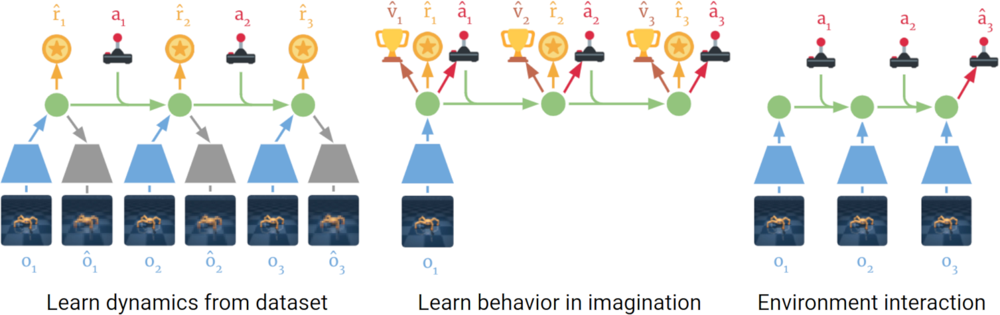

# Dream to Control: Learning by Latent Imagination

This repository implements the method proposed in the paper "[Dreamer: Learning Behaviors with Latent Imagination](https://arxiv.org/pdf/1912.01603)" to solve the Acrobot task in Gymnasium.

## Overview

Dreamer is a model-based reinforcement learning algorithm that learns a world model capable of predicting future states of the environment in a compact feature space. Using this world model, Dreamer imagines future trajectories and learns both a policy and a state-value function. These value gradients are backpropagated through multi-step predictions, enabling Dreamer to efficiently learn a long-horizon policy without direct interaction with the environment.

The method consists of two key components:
1. **World Model**: Learns a latent space where states are represented compactly. It predicts future states by encoding the environment dynamics and transitions.
2. **Dreaming Algorithm**: Utilizes the learned world model to "dream" about future states and use these imagined trajectories to optimize the policy.

This repository focuses on applying the Dreamer algorithm to the Acrobot environment within Gymnasium.

## Method



Dreamer learns a world model that predicts future states in a latent feature space. These imagined future sequences are then used to learn a policy and a state-value function. By backpropagating value gradients through these multi-step imagined trajectories, Dreamer can effectively learn a policy over a long horizon despite receiving sparse or delayed rewards.

## Requirements
To run this project, ensure you have the following dependencies installed:
- Torch 2.2.0
- Gymnasium 0.29.1
- Numpy 1.24.4
- Matplotlib 3.7.3

## Installation 

1. Clone the repository:

```bash
git clone git@github.com:FrancescoSpena/Dream-to-control.git
```
2. Navigate into the project folder:
```bash
cd Dream-to-control/
```
3. Install the required dependencies:
```bash
pip install -r requirements.txt
```
4. (Optional) If you want to use a GPU for faster training, make sure you have the necessary CUDA dependencies installed.

## Usage 
The agent utilizes three different neural models. Therefore, the first step is to train the model that approximates the environment's transition function.
### Training
To train the different neural models, run the following commands:
- Transition function model:
```bash
cd src/ && python3 train_transition.py
```

- Reward function model:
```bash
python3 train_reward.py
```

Actor-critic model: 

```bash
python3 train_actor_critic.py
```

### Testing 
To test the trained model and run the environment, use the following command:
```bash
python3 main.py --render
```
Available options:
- --render: displays the graphical environment during execution.

## Acknowledgments
* The original paper:

```bib
@article{hafner2019dreamer,
  title={Dream to Control: Learning Behaviors by Latent Imagination},
  author={Hafner, Danijar and Lillicrap, Timothy and Ba, Jimmy and Norouzi, Mohammad},
  journal={arXiv preprint arXiv:1912.01603},
  year={2019}
}
```
   
